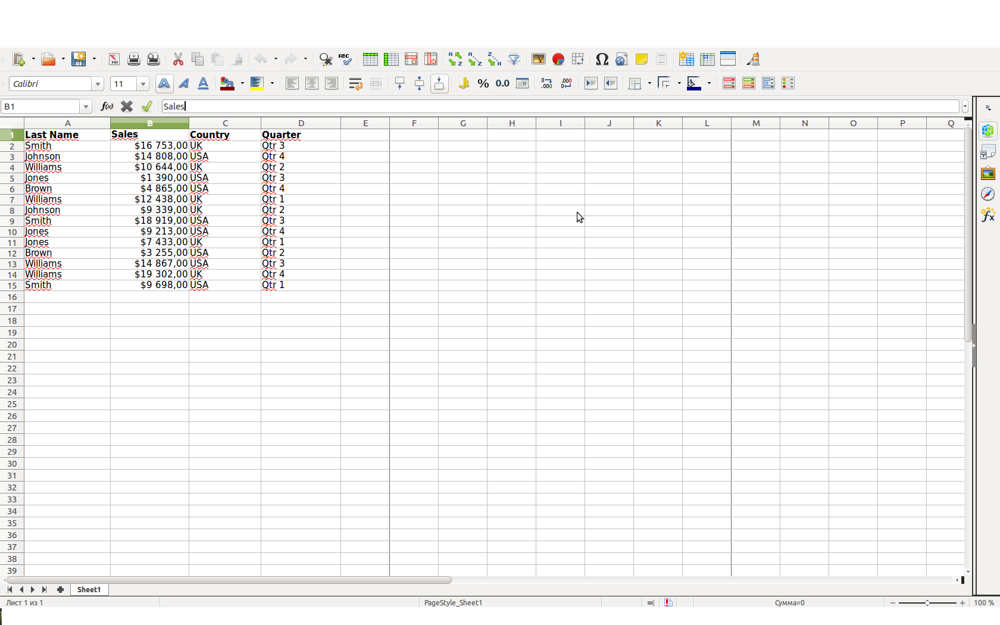
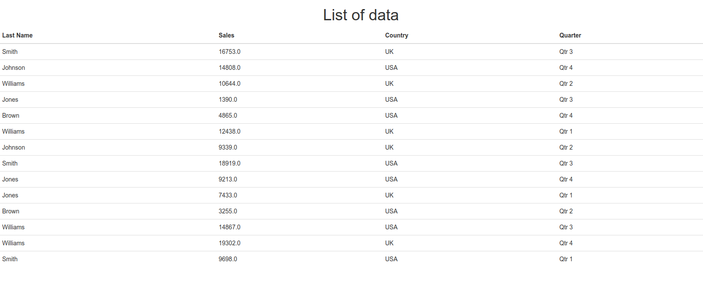

# Spreadsheet

Simple Rails-App based on ["Roo" gem](https://github.com/roo-rb/roo) for 
parsing excel documents. \
Rake task upload an Excel file, parse it and output data.
####Some spreadsheet

####Output data

